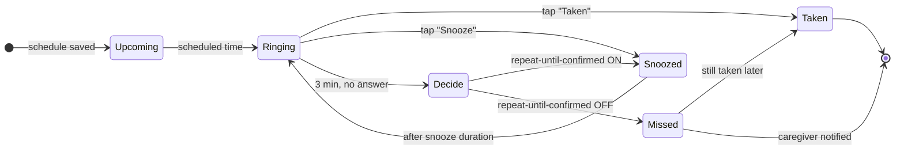

<div align="center">

<picture>
  <source media="(prefers-color-scheme: dark)" srcset="asset/readme/logo-teks-dark.svg">
  
</picture>

**Medicine and appointment reminders — for the person taking them, and the person looking after them.**

-22C1C4?logo=android&logoColor=white)


[What it does](#what-it-does) · [Two roles](#two-roles-one-schedule) · [How a reminder lives](#how-a-reminder-lives) · [Tech stack](#tech-stack) · [How to run](#how-to-run) · [Team](#the-team)

</div>

---

Most reminder apps assume you're alone. In real life, a lot of medication is taken with someone
else keeping an eye on it — a daughter checking on her dad, a nurse on a patient, a friend who
promised to nag. MedUMinder is built around that pair: the **consumer** who takes the medicine, and
the **caregiver** who gets told when a dose is taken, snoozed, or missed.

It rings like an alarm, not a quiet notification, and it doesn't give up after the first try if you
don't want it to.

## What it does

Click a row to open it.

<details>
<summary><b>An alarm you can't accidentally ignore</b></summary>
<br>

- Plays your phone's **alarm sound** at the scheduled time — even with the app closed, and still after the phone restarts.
- **Taken** or **Snooze** straight from the alarm notification, or from inside the app.
- No answer within **3 minutes**? Two options, chosen in *Notification settings*:
  - **Repeat until confirmed** on → it snoozes itself and rings again after your snooze duration (5 / 10 / 30 min), over and over, until someone answers.
  - Off → the dose is marked **missed** and your caregivers are told.
- A heads-up notification a few minutes before the dose, so it never comes out of nowhere.

</details>

<details>
<summary><b>Medicine schedules that know about stock</b></summary>
<br>

- Once up to six times a day, at times you pick, with an optional end date.
- Pick a medicine from the shared catalog or type a new one (it gets added for everyone).
- Pills track remaining stock and drop by one each time you confirm a dose. When it's running low you get a **refill** notification.
- Delete one dose, or the whole schedule. Already-taken history stays for your statistics.

</details>

<details>
<summary><b>Appointments</b></summary>
<br>

- Doctor visits, lab tests, therapy — anything with a place and a time.
- Reminder 30 min / 1 hour / 2 hours before (your choice), then the alarm at the time itself.
- Mark it **attended**. If the time passes without that, it's marked **missed** and caregivers hear about it.

</details>

<details>
<summary><b>History, statistics and a PDF report</b></summary>
<br>

- Consumption and appointment history for today and yesterday, filterable by upcoming / taken / missed.
- Adherence percentage with weekly, monthly and yearly charts.
- A response breakdown: how often doses are taken vs. snoozed vs. ignored.
- **Download report** makes a two-page PDF (charts drawn as vectors, so they stay sharp when printed) — handy to show a doctor.

</details>

<details>
<summary><b>Caregiver mode</b></summary>
<br>

- Invite someone by email as your caregiver, or offer to be theirs. The invite works even if they haven't signed up yet — it's waiting in their notifications when they do.
- One caregiver can look after several people; switch between them from the side drawer.
- Caregivers can add, edit and delete schedules for the person they look after.
- **Remind consumer** sends a nudge — but only when it still makes sense (not for a dose that's already taken or an appointment that's already over).
- One account can be both a consumer and a caregiver. Notifications are kept separate per role so they don't get mixed up.

</details>

<details>
<summary><b>Everyday comfort stuff</b></summary>
<br>

- Bahasa Indonesia, English and 中文 — switchable inside the app. Notifications change language too, even old ones.
- Light and dark mode, both designed on purpose (not just inverted).
- Loading states on everything that waits for the network, and double-tap protection on buttons that save things.
- Layouts adapt to shorter screens (tested on a POCO M4 and a Samsung A-series) instead of cutting things off.

</details>

## Two roles, one schedule

| | Consumer | Caregiver |
|---|---|---|
| Gets the alarm | ✅ | — |
| Marks taken / attended | ✅ | — |
| Adds & edits schedules | ✅ own | ✅ for the people they care for |
| Hears about snoozes & misses | their own | ✅ for everyone they care for |
| Can send a reminder | — | ✅ |
| Sees statistics & PDF report | ✅ | ✅ |

Switching roles happens in **Profile**. Turning on caregiver mode is a one-time step.

## How a reminder lives

This is the whole life of a single dose, including the part most people never see:



Appointments follow the same shape, except there's no snooze once they've been missed — you can't
really be late to a check-up that already happened.

## Tech stack

| Part | What we use |
|---|---|
| Language | Java 11, XML layouts |
| UI | AndroidX AppCompat, Material Components 1.13, ConstraintLayout |
| Navigation | One `MainActivity` hosting fragments with Jetpack Navigation 2.9 |
| Login | Firebase Authentication — email/password, and Google sign-in through Credential Manager |
| Database | Cloud Firestore |
| Charts | MPAndroidChart 3.1 in the app; the PDF report draws its own charts on `Canvas` |
| Other bits | Country Code Picker (phone input), AndroidX SplashScreen |
| Build | Gradle with AGP 8.13 · compile SDK 36 · min SDK 28 · target SDK 35 |

## How to run

**You'll need:** Android Studio (a recent version that supports AGP 8.13), JDK 17 for Gradle, and an
Android phone or emulator running **Android 9 (API 28)** or newer.

1. **Clone the repo**
   ```bash
   git clone git@github.com:yimeiw/MedUMinder_v1.git
   ```
2. **Open it in Android Studio** — *File → Open* and pick the `MedUMinder_v1` folder.
   Let Gradle sync finish (the first time takes a few minutes while it downloads dependencies).
3. **Firebase is already wired up.** `app/google-services.json` in the repo points at the team's
   project, so login and data work straight away. Want your own? See below.
4. **Pick a device and press ▶ Run.** On a real phone, turn on *Developer options → USB debugging* first.
   Prefer the terminal?
   ```bash
   ./gradlew installDebug
   ```
5. **Allow the permissions** the app asks for on first launch — notifications, and *Alarms & reminders*
   on Android 12+. Without them, reminders can't ring on time.

<details>
<summary><b>Using your own Firebase project</b></summary>
<br>

1. Create a Firebase project and add an Android app with package `com.example.meduminderv1`.
2. Download its `google-services.json` and replace `app/google-services.json`.
3. **Authentication** → enable *Email/Password* and *Google*.
4. For Google sign-in, add your debug SHA-1 in the Firebase console. You can get it with:
   ```bash
   ./gradlew signingReport
   ```
5. Create a **Firestore** database. The app creates what it needs the first time it's used.

</details>

<details>
<summary><b>On Xiaomi / POCO / Redmi phones</b></summary>
<br>

MIUI and HyperOS stop background apps aggressively, which silences reminders. Also turn on:

- Settings → Apps → MedUMinder → **Autostart**
- Battery saver → **No restrictions**

</details>

<details>
<summary><b>Checking how it looks on a smaller screen</b></summary>
<br>

```bash
adb shell wm size 1080x1920 && adb shell wm density 480
adb shell wm size reset && adb shell wm density reset
```

Or *Developer options → Smallest width → 360*.

</details>

## The team

Built by **Yimei Winata** ([yimeiw](https://github.com/yimeiw)),
**Claribel Aurelia Tan** ([Clatan](https://github.com/Clatan)) and
**Selina** ([selinassel](https://github.com/selinassel)).

<sub>No license yet — please ask before reusing the code or the design.</sub>
